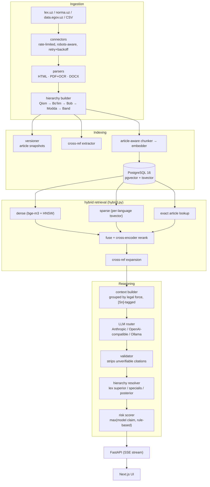

<div align="center">

# QonunAI

**An AI legal research platform for the Republic of Uzbekistan — a hybrid-RAG system that answers legal questions in Uzbek (Latin & Cyrillic), Russian, and English, grounded in real statutory text with verifiable article-level citations.**

Every legal claim resolves to a real `[Sn]` source tag. Citations to articles that were never retrieved get stripped before they reach the user, not just flagged — see [How the anti-hallucination guarantee actually works](#how-the-anti-hallucination-guarantee-actually-works).

**[→ Try the live app](https://ai-frontend-ten-roan.vercel.app)**  ·  [API](https://uzlex-ai.fly.dev/docs)  ·  [Health & corpus status](https://uzlex-ai.fly.dev/health)

[](https://github.com/AbdullohRR/QonunAI/actions/workflows/backend-tests.yml)
[](https://www.python.org/)
[](https://fastapi.tiangolo.com/)
[](https://github.com/pgvector/pgvector)
[](LICENSE)

</div>

---

**At a glance.** 13 codes indexed, 11,538 chunks, live on Fly.io + Vercel.
Retrieval scores **Recall@5 = 0.931, MRR = 0.852** on `uzlegal-v1`, a 58-question
gold set spanning every indexed act — see [Retrieval benchmark](#retrieval-benchmark),
which also records where an earlier, better-looking 1.000 came from and why it
was not kept. 503 tests run on every push.

This README is long on purpose: it documents what was measured, what was tried
and rejected, and where the system still fails. If you are skimming, these four
sections carry the engineering:

| | |
|---|---|
| [Architecture](#how-it-works--architecture) | How a question becomes a cited answer |
| [Anti-hallucination](#how-the-anti-hallucination-guarantee-actually-works) | Why a fabricated citation cannot reach the user — and the bug that broke it |
| [Retrieval benchmark](#retrieval-benchmark) | The measurements, including the unflattering ones |
| [Deployment status](#deployment-status) | Four defects that hid a silently-dead dense retrieval path |

---

## What is this?

Ask a legal question the way you'd actually ask it — in any of four languages, in
either Uzbek script — and get back an answer grounded only in the actual text of
the Constitution and Codes, never a guess from the model's own training data.

> "Жиноят кодексининг 97-моддасида қандай жазо белгиланган?"
> "Какие основания для расторжения трудового договора по инициативе работодателя?"
> "14 yoshli o'smir o'g'irlik qilsa, javobgarlikka tortiladimi?"

...or upload a contract and get a clause-by-clause compliance screen against
mandatory Uzbek law, with concrete risks and redrafting suggestions — not a
generic "looks fine to me."

## Demo

<div align="center">

</div>

*Real conversation against the actual running app — retrieval, LLM generation, and citation-tagged output, not a mockup.*

Two more below show behaviour rather than chrome:
[answering in the script you typed](#reply-in-the-script-the-user-typed) and
[answering at the length you asked for](#answer-at-the-length-that-was-asked-for).
Both are drawn from recorded sessions against `uzlex-ai.fly.dev` — the
questions, answers, sources, retrieval times and elapsed times in them are the
captured ones, rendered as a terminal rather than filmed from the browser.

## Key features

| | |
|---|---|
| **Citation-grounded Q&A** | Every legal statement carries an `[Sn]` tag resolving to a specific article. Uncited or unverifiable answers are rejected, not softened. |
| **Article-level deep links** | Citations open the *provision*, not the top of a 4 MB document — `lex.uz/docs/6257288#6259020` lands directly on 80-modda. See [Deep linking into lex.uz](#deep-linking-into-lexuz). |
| **Hybrid retrieval** | Dense (`bge-m3` + pgvector HNSW) + sparse (per-language Postgres FTS) + article-title + exact-article lookup, fused by RRF. Cross-encoder reranking is implemented but off in the live deployment — see [Deployment status](#deployment-status). |
| **Legal hierarchy reasoning** | Constitution > Codes > Laws > Decrees, then *lex specialis*, then *lex posterior* — computed deterministically from adoption dates and act type, not left to the model to reason about on the fly. |
| **Cross-reference expansion** | "…in the cases provided for by Article 333 of this Code" automatically pulls Article 333 into context. |
| **Document analysis** | Contracts segmented clause-by-clause, screened against mandatory Uzbek norms by both regex red-flags and an LLM compliance pass, with risk levels and concrete redrafting suggestions. |
| **Trilingual + dual-script** | Uzbek Latin↔Cyrillic transliteration on both queries and index. Ask in Russian, retrieve from a Cyrillic-only source, answer in Russian — cross-language retrieval, not just translation. |
| **Independent risk scoring** | The risk level shown is the *higher* of the model's own claim and a rule-based assessor (procedural deadlines, criminal exposure, conflicting provisions) — under-stating risk is the expensive failure mode here. |
| **Provider-agnostic LLM layer** | Anthropic, any OpenAI-compatible endpoint (Groq, Gemini, vLLM, Together), or local Ollama — swappable via one env var, no code changes. |
| **Answers shaped by how you asked** | Reply in the script you typed, at the length you asked for, and answer ordinary questions like a person instead of deflecting — see [Answering the way the question was asked](#answering-the-way-the-question-was-asked). |
| **Four ways to sign in** | Email, Telegram, Google, and phone-by-SMS — each dormant until its provider is configured, never a button that cannot work. See [Accounts and sign-in](#accounts-and-sign-in). |
| **Plans and billing** | Free / signed-in / Pro tiers with per-day request limits, and a Payme merchant integration for Pro — see [Plans and billing](#plans-and-billing). |

## Tech stack

- **Backend:** FastAPI, SQLAlchemy 2 (async), Alembic, Celery + Redis (ingestion, corpus stats, connector health checks)
- **Retrieval:** PostgreSQL 16 + pgvector (HNSW cosine), `BAAI/bge-m3` multilingual embeddings, Postgres full-text search, `BAAI/bge-reranker-v2-m3` cross-encoder
- **LLM layer:** a thin provider router — Anthropic, OpenAI-compatible (Groq / Gemini / vLLM / Together), or local Ollama, selectable globally or per-request
- **Frontend:** Next.js 16 (App Router), React 19, TypeScript (strict), Tailwind — token-streamed SSE chat with markdown rendering and deep-linked citation cards
- **Ingestion:** rate-limited, robots-aware connectors for lex.uz / norma.uz / data.egov.uz, with HTML/PDF+OCR/DOCX parsing and a hierarchy builder (Qism → Bo'lim → Bob → Modda → Band)

## How it works — architecture



Full diagrams and design rationale: [`docs/ARCHITECTURE.md`](docs/ARCHITECTURE.md).

## How the anti-hallucination guarantee actually works

The hard part of a legal AI isn't generating fluent text — it's refusing to
invent law. Prompt instructions alone don't achieve that, so the guarantee is
enforced mechanically, not just requested:

1. Retrieved passages are tagged `[S1]…[Sn]`; the valid tag set is recorded
   *before* the model sees the question.
2. The model is instructed to cite those tags inline and to say plainly when
   the sources don't cover the question.
3. **The validator then checks the output against that recorded tag set.**
   Tags outside it are stripped from the answer. Article numbers asserted in
   prose but absent from retrieval are flagged as unverified. A tag attributed
   in prose to the wrong act (real tag, real article, just the wrong law
   named next to it — the subtlest of the three failure modes, since both the
   tag and the article number check out individually) gets an inline
   correction appended right where the false claim was made, not just a
   warning at the end the reader has to cross-reference. A substantive answer
   with no citations at all is rejected outright and replaced with an honest
   "not found" message.
4. The risk scorer runs independently of the model's own risk claim (if it
   makes one — the prompt asks it not to, since the risk badge already
   renders this from the same structured assessment) and takes the
   **higher** of the two. If the model states a level anyway, it's
   reconciled to match rather than left to silently contradict the badge.
5. The streamed `done` event carries the *validated* text, and the client
   swaps it in — so a stripped citation never stays on screen, even for the
   tokens that streamed before validation ran.

### The way this guarantee actually got broken

Worth recording, because the mechanism was subtle and the lesson generalises.

Everything above protects answers that go *through* retrieval. It says nothing
about a question that never reaches it — and a routing change quietly created
exactly that path.

Deciding "not a legal question" used to happen *after* retrieval, where the
real work was done by a different rule: **a question that found sources is
legal by demonstration.** The scope check only sorted what was left over, so
it could afford to be a rough heuristic.

Moving that check in front of retrieval — a fix for a real problem, since a
deflection passes validation cleanly and gives nothing to hook — made it the
sole arbiter. Under that load its default was backwards: *absence of legal
vocabulary became proof of a non-legal question.*

Measured on ordinary phrasings, **4 of 11** genuine legal questions fell
through, because no word in them is an act name, an article number, or a
glossary term:

| Question | Why it slipped |
|---|---|
| «Ishdan boʻshash tartibi qanday?» | dismissal — no statutory term in the sentence |
| «Ишдан бўшаш тартиби қандай?» | same, Cyrillic |
| «Как разделить имущество при разводе?» | divorce, property division |
| «How many days of annual leave am I entitled to?» | entitlement phrased as a person would |

Each was answered from the model's own memory: confident specifics, **no
citation, no source panel, `retrieval_ms: 0`.** The one failure mode the
project exists to prevent, reached through the component meant to prevent it —
and invisible from outside, because an ungrounded answer looks exactly like a
grounded one until you check whether any source was consulted.

The prompt-level backstop did not save it either. `GENERAL_SYSTEM` already
says, in as many words, to treat a disguised legal question as legal and
refuse to answer from memory. The model ignored it — the same lesson as point
3 above, arriving a second time by a different door: **grounding holds because
of a mechanism, not because the prompt asks for it.**

The fix is not more legal keywords. Law has no closed vocabulary, so every
gap in such a list is silent and dangerous. The *non-legal* side is enumerable
in the only sense that matters: a miss there is harmless. So the conversational
path now requires **positive evidence of an everyday topic** — cooking,
weather, sport, translation — and the deliberate gap between "looks legal" and
"looks everyday" falls to the legal side. An unrecognised question about
restaurants gets a stiff "the retrieved provisions don't cover this", which is
a worse conversation and not a wrong answer.

Verified on the live instance after the fix — the same question that had
returned `retrieval_ms: 0`:

```
Ishdan bo'shash tartibi qanday?   → retrieval_ms 1692 · 9 sources · 3 citations
Osh qanday pishiriladi?           → retrieval_ms    0 · conversational, as intended
```

## Deep linking into lex.uz

A citation that opens a four-megabyte document and leaves you to scroll isn't a
citation. QonunAI links straight to the article — and getting there required
working out how lex.uz actually addresses provisions, because it isn't documented.

There is no `#article80` anchor. Every structural node has a stable numeric id,
surfaced in the table of contents as `scrollText('6259020')`. That handler does
`history.pushState(null, '', '#' + hash)`, a matching element carries
`id`/`name` with that value, and `window.onload` re-reads the hash — so a
pasted link scrolls correctly on a cold load. The canonical form is therefore:

```
https://lex.uz/docs/6257288#6259020   → 80-modda
```

Two things make naive extraction wrong, both found by measuring rather than assuming:

- **Sub-numbered articles.** lex.uz renders article 57¹ as the literal text
  `Статья 57 1 .` — space-separated digits, not a superscript entity. Parsing
  only the leading number collapses 57, 57¹ and 57² into one key. They are
  legally distinct provisions, so they're normalised to `57`, `57-1`, `57-2`.
- **The corpus had already collapsed them.** `chunks.article_number` holds no
  separators, so all three were stored as `"57"`. Matching an anchor on article
  number alone would mis-link two of every three. Disambiguation runs on the
  heading, and returns nothing rather than guessing — a document-level link is
  acceptable; a link to the wrong article is not.

Measured: **581/581** articles resolved on the Labour Code (uz-Cyrl) and
**404/404** on the Criminal Code (ru). Backfilled across all 13 indexed acts,
**84.2%** of chunks (9,710/11,538) carry an anchor; the rest are chunks with no
article number, or genuinely ambiguous ones, and degrade to document links.

```bash
# Honours lex.uz's published Crawl-delay of 20s — do not parallelise.
docker compose exec backend python -m app.workers.backfill_anchors --dry-run
```

## Answering the way the question was asked

Three behaviours that sound like prompt tweaks and were not. Each needed a
mechanism, and each failed first in a way worth recording.

### Reply in the script the user typed

Uzbek is written in both Latin and Cyrillic, and the corpus is mostly
Cyrillic. Asked in Latin, the model kept answering in the script of the
*sources* it had just read — reasonable-looking behaviour that is wrong for a
reader who cannot comfortably read the other script.

Detection was never the problem; it was correct from the start. The instruction
was simply being ignored, and it started being obeyed only once the prompt
**named the letters** rather than the script — "ў, қ, ғ, ҳ" instead of
"Cyrillic".

<div align="center">

</div>

*The same question in both scripts, against the live API. Note the source in
each: one Cyrillic article, 106-modda of the Labour Code, answered back in
whichever script the question used.*

### Answer at the length that was asked for

"juda qisqa" (very short) produced a **2,541-character** answer — longer than
the default. The instruction was in the cached system prefix, and a cached
prefix loses to immediate context and to the model's own previous turns. Moving
the restatement into the user turn, where recency actually carries, fixed it.

<div align="center">

</div>

Measured against the live API, *«Ishdan boʻshash tartibi qanday?»* asked twice:

| Same question | Answer | Sources |
|---|---|---|
| asked plainly | 1,750 chars | 10 |
| `+ juda qisqa` | **615 chars** | 9 |

The point of the second column is that shortening changes the *answer*, not the
grounding — the short reply still retrieves and still cites.

The directive is also *remembered*: ask for short answers once and following
turns stay short, and `_resolve_turn` walks back past runs of consecutive
directives so "shorter" then "even shorter" still resolves to the last real
question rather than to another directive.

### Answer ordinary questions like a person

Greetings, small talk and "what can you do" are answered deterministically,
without an LLM call. Beyond those, an everyday question gets a warm, ordinary
reply instead of a bureaucratic non-answer:

```
"Salom! Sen nima qila olasan?"  →  "Salom! Men Oʻzbekiston Respublikasining
                                    qonunlari boʻyicha savollarga javob beraman…"
```

This is the feature that created the grounding hole described
[above](#the-way-this-guarantee-actually-got-broken) — worth reading as a pair,
because the pleasant behaviour and the dangerous one came from the same change.

## Accounts and sign-in

Four methods, all live in the API. Each stays **dormant until its provider is
configured** — an unconfigured provider returns a clean `503`, the UI does not
render its button, and no third-party script is loaded. A sign-in button that
cannot work is worse than no button.

| Method | Endpoint | What makes it trustworthy |
|---|---|---|
| Email + password | `POST /api/v1/auth/register` · `/login` | bcrypt, 8-char minimum enforced on both sides |
| Telegram | `POST /api/v1/auth/telegram` | HMAC over the login payload, key = `SHA256(bot_token)`; 24 h TTL |
| Google | `POST /api/v1/auth/google` | RS256 ID token, **`aud` checked against our own client id** |
| Phone (SMS) | `POST /api/v1/auth/phone/request` · `/verify` | hashed codes, 5-guess cap, 5-min expiry, 60 s resend cooldown |

Two of those checks are the ones most often missing, so they get named
explicitly:

- **Google: verifying the signature is not enough.** An ID token is signed by
  Google for *some* application. Accept any validly-signed token and an
  attacker signs into their own unrelated site, posts the token they were
  given here, and is logged in as that Google account — signature perfectly
  valid, just not issued for us. `aud` must equal our client id.
- **Phone: nobody else vouches for the user.** There is no third party
  attesting anything — we send a code and trust whoever reads it — so the
  whole burden sits on four controls. Codes are stored only as a SHA-256 hash
  salted with *both* the phone number and `SECRET_KEY` (the number-salt stops
  a hash being replayed against a different number; the app secret means a
  stolen table alone cannot precompute all million codes). Six digits is a
  million combinations, which a script walks in minutes — the **5-attempt cap**
  is the control, not the code length, and the failure is counted *before* the
  comparison returns or the cap never bites.

Numbers normalise to E.164 before anything else, so `90 123 45 67`,
`+998 90 123-45-67` and `998901234567` are one account rather than three, two
of them unreachable. And `/phone/request` answers identically whether or not
the number is registered — a distinguishable response would make it a tool for
testing which numbers have accounts.

> Accounts created through Telegram, or through Google without a verified
> address, have **no email**. The frontend `User` type said `string` while the
> API had already started returning `null`, which crashed the account menu on
> `email.split('@')` — for exactly the users those two providers had just
> enabled. Display names now fall back name → email → phone → generic, and
> every branch is reachable.

## Plans and billing

| Tier | Requests / day | How you get it |
|---|---|---|
| Anonymous | 50 | just use it — no sign-up |
| Signed in | 500 | any of the four sign-in methods |
| Pro | 5,000 | Payme subscription |

Limits are per rolling day (`RATE_LIMIT_WINDOW_SECONDS = 86400`) and enforced
in Redis.

Pro is billed through **Payme (Paycom)**, whose Merchant API is JSON-RPC 2.0
over a single endpoint — `POST /api/v1/payments/payme` — with amounts in
*tiyin*, states `1 / 2 / -1 / -2`, and **HTTP 200 on every response** including
errors, which are carried in the JSON-RPC `error` object instead.

Four things there are about money rather than protocol, and they are what the
tests aim at:

- **Every handler is idempotent.** Payme retries. A second `CreateTransaction`
  for the same id must return the existing transaction, not open a second
  charge; a repeated `PerformTransaction` must not extend the subscription
  twice.
- **The amount is checked, not accepted.** 79,000 soʻm is 7,900,000 tiyin
  exactly — anything else is refused rather than taken at whatever was sent.
  Floats are refused too; they do not survive reconciliation.
- **The merchant key is compared in constant time.** This endpoint is public
  by necessity, and a plain `==` leaks the secret's prefix through timing.
- **Unperformed transactions expire.** Payme cancels after 12 hours; honouring
  one later would take money for a checkout the payer abandoned.

Billing stays off until `PAYME_ENABLED=true`, and the checkout button is hidden
while it is off.

## Interface

The frontend is a full product surface, not a debug console: a marketing
landing page, a streamed chat view with deep-linked citation cards and risk
badges, sign-in and pricing dialogs, and a document-analysis view.

- **Design tokens, not hard-coded colours.** One CSS-variable palette in
  `globals.css` with role names (`surface`, `border`, `accent`, `muted`), and
  Tailwind maps to those rather than to raw hex — so dark mode is a token swap
  under a `class` strategy, not a second set of utilities per element.
- **Contrast and touch targets are checked, not eyeballed.** Body text meets
  WCAG AA against both palettes; interactive controls are ≥44 px tall.
- **16 px inputs on mobile**, below which iOS Safari zooms the page on focus.

## Setup

### Requirements

- Docker + Docker Compose
- An LLM API key — Anthropic, or any OpenAI-compatible provider (Groq, Gemini,
  etc.). A local-only path via Ollama also works with no API key at all.

### Install & run

```bash
cp .env.example .env
# set SECRET_KEY and at least one LLM provider key
docker compose up -d --build
```

Load a corpus — this repo's bundled CSV path is instant and deterministic:

```bash
docker compose exec backend python -m scripts.bootstrap \
  --admin admin@yourfirm.uz \
  --seed-csv-dir /app/data/seed
```

Open **http://localhost:3000**. API docs at **http://localhost:8000/docs**.

Full instructions, including crawling lex.uz directly: [`docs/DEPLOYMENT.md`](docs/DEPLOYMENT.md).

> **Iterating on the code?** `docker-compose.yml` bind-mounts `backend/app`
> into the backend, worker, and beat containers — a plain `docker compose
> restart backend` picks up code changes. `.env` changes need a recreate:
> `docker compose up -d backend`.

## Production deployment

The live instance runs split across two providers:

| Component | Host | Notes |
|---|---|---|
| Frontend | Vercel | Next.js 16, streams SSE from the API |
| API | Fly.io (`fra`) | FastAPI, `shared-cpu-4x` / 2 GB |
| Postgres + pgvector | Fly.io | 3 GB volume, private networking only |
| Redis | Fly.io | Rate limits and cache, private networking only |

Neither datastore is publicly reachable — the API talks to them over Fly's
private network, and the schema is migrated through a temporary
`flyctl proxy` tunnel rather than an exposed port.

```bash
cd backend && flyctl deploy --now
```

**Measured end-to-end on the live instance** (Labour Code question,
uz-Latn): retrieval **346 ms**, LLM generation **11,090 ms**, total
**12.7 s**. Generation is 87% of wall-clock — retrieval is not the
bottleneck, so optimisation effort belongs in prompt caching, context size,
and time-to-first-token rather than in the retriever.

> Machines are configured to scale to zero (`min_machines_running = 0`), so
> the first request after an idle period pays a cold start that includes
> loading the embedding model. Set it to `1` before a demo.

## API surface

| Endpoint | Purpose |
|---|---|
| `POST /api/v1/chat/stream` | SSE legal Q&A — `meta` → `sources` → `delta`* → `done` |
| `POST /api/v1/chat` | Non-streaming equivalent |
| `POST /api/v1/search` | Raw hybrid retrieval, no LLM — inspect what RAG actually finds |
| `POST /api/v1/search/article` | "Ask by article" — fetch and explain a named article |
| `POST /api/v1/documents/analyze` | Upload and analyse a contract |
| `GET /api/v1/laws` · `/{id}/tree` | Browse acts and their structural trees |
| `GET /api/v1/laws/{id}/articles/{n}/timeline` | Version history and diffs |
| `GET /api/v1/alerts` | New / amended acts |
| `POST /api/v1/auth/register` · `/login` · `/refresh` · `/me` | Email accounts and session tokens |
| `POST /api/v1/auth/telegram` · `/google` | Social sign-in — verify a signed payload, issue our own tokens |
| `POST /api/v1/auth/phone/request` · `/phone/verify` | SMS code request and exchange |
| `POST /api/v1/payments/payme` | Payme merchant JSON-RPC endpoint (`CheckPerformTransaction`, `CreateTransaction`, `PerformTransaction`, `CancelTransaction`, `CheckTransaction`, `GetStatement`) |
| `POST /api/v1/admin/ingest` | Trigger ingestion (admin) |
| `GET /api/v1/admin/connectors/health` | Connector reachability + selector validation |
| `GET /health` | Liveness, corpus size, provider status |

## Tests

```bash
cd backend && pytest tests/ -v
```

503 unit tests, no database or network required — verified passing. They cover
the places where a silent regression is most damaging: transliteration (halves
Uzbek recall if wrong), hierarchy parsing (wrong citations), citation
validation (hallucinations reaching users), the hierarchy-of-force rules
(wrong legal conclusions), anchor extraction (citations that open the wrong
article), the scope gate (legal questions answered without sources), token
verification for all three sign-in providers, and the Payme state machine.

Some of them assert things that read oddly until you know what they caught:

```python
assert "compare_digest" in inspect.getsource(payme.check_auth)
assert claims.get("email_verified") is True   # not `in (True, "true")`
```

The first pins a constant-time comparison on a public endpoint against a
future refactor that would "simplify" it to `==`. The second exists because
Python holds `1 == True`, so a membership test silently accepts the integer
`1` as a verified Google address — found by a test that fed it exactly that.

> **Never pipe the command that gates a deploy.** `pytest -q | tail -2 && git
> commit && fly deploy` returns *tail's* exit code, so the gate is always
> green. That is how a syntax error reached production here and took the API
> down with a crash loop.

## Deployment status

The live app runs dense retrieval, sparse full-text search, article-title
search and exact-article lookup, fused by RRF. **Cross-encoder reranking is
implemented but switched off** — see below.

For most of this project's life dense retrieval was silently dead.
`sentence-transformers` was never listed in `requirements.txt`, so every chunk
carried a real `bge-m3` vector (1024-dim, unit-norm, 11,042 distinct across
11,538 chunks) while the *query* side could not embed at all. The dense branch
raised on every request, the retriever fused three branches instead of four,
and the reranker never loaded. Nothing reported it: `/health` showed
`embedded_chunks: 11538` and a green status throughout, because that field
counts documents and cannot detect a broken query path.

Three further defects were hiding behind that one, each only visible once the
one in front of it was fixed:

1. **torch was pinned below 2.6.** `transformers` refuses `torch.load` on older
   versions (CVE-2025-32434) and bge-m3 ships `.bin` weights, so the model
   would have failed to load regardless of available memory.
2. **Baking the weights into the image made it undeployable.** A 4.8 GB image
   exceeds Fly's machine-update timeout; the API returns HTTP 408, `flyctl
   deploy` swallows it and reports success, and the machines keep running the
   previous image. Weights are now downloaded at runtime and the startup warmup
   runs in the background so the port binds immediately.
3. **The relevance threshold silently capped recall at three results.**
   `MIN_RELEVANCE_SCORE` is calibrated for the cross-encoder's sigmoid output,
   but the score falls back to the RRF fused value (~0.016–0.065), which can
   never clear a 0.25 threshold. With the reranker off, every candidate was
   discarded on every query and a three-result fallback took over.

### What dense retrieval bought

Cross-language retrieval, which the corpus makes essential:

| Script / language | Chunks | Share |
|---|---|---|
| Uzbek Cyrillic | 5,904 | 51% |
| Russian | 4,927 | 43% |
| Uzbek Latin | 707 | 6% |

Latin↔Cyrillic is bridged lexically by the transliteration layer. **Uzbek↔Russian
is bridged only by the shared embedding space** — nothing lexical connects
`odam oʻgʻirlash` to `похищение человека`.

Concretely, *"Odam oʻgʻirlash uchun qanday jazo belgilangan?"* previously
returned four results and never reached Criminal Code art. 137. It now returns
eleven and ranks art. 137 by embedding similarity (0.60). Benchmark-wide, MRR
went from 0.694 to 0.807 and Recall@1 from 0.600 to 0.733.

### Why reranking is off: the arithmetic

Reranking was pursued through three models and two architectures. It is off,
and the reason is not tuning.

**Model selection.** `bge-reranker-base` (278M) is small enough but trained on
Chinese and English only — against Russian its scores clustered at 0.5000,
0.5027, 0.5042, and sigmoid(0) is exactly 0.5, so it was emitting near-zero
logits and reordering by noise. Recall@1 fell 0.793 → 0.569.
`jina-reranker-v2-base-multilingual` (278M) is the right model: genuinely
multilingual, and it scores «Понятие сделок» 0.32 against 0.13 for an unrelated
article.

**Architecture.** Run in-process the reranker contends with the query embedder
for the same cores behind one uvicorn worker — 40s per query, then nothing
completing. So it now runs as [its own service](reranker-service/), reachable
only at `uzlex-reranker.internal`, and that part works: the service loads, the
scores discriminate, and the client degrades to fused order when it cannot
answer.

**It still does not help, and the reason is arithmetic.** A transformer forward
pass costs roughly `2 × params × tokens`. For 12 candidates at 96 tokens
against a 278M model that is about 640 GFLOP. Two dedicated CPU cores deliver
on the order of 50 GFLOPS, so ~13 seconds — which is exactly what was measured:

| Passages × tokens | shared-cpu-4x | performance-2x |
|---|---|---|
| 12 × 96 | — | 13.0 s |
| 12 × 320 | 272 s | 26.0 s |
| 8 × 320 | 75 s | — |
| 4 × 320 | 8.8 s | 19.7 s (cold) |

The superlinear blow-up on shared CPU is throttling; the dedicated-CPU numbers
are the real cost. Reaching a ~1s rerank needs roughly 15× more compute. That
is a GPU, where the same work is milliseconds — not a smaller model, a shorter
sequence, or a different host size.

Retrieval currently answers in ~2.1s with Recall@5 = 0.931 and Recall@10 =
0.983 without reranking at all. Paying 13s for a possible reordering of results
that are already correct 93% of the time is not a trade worth making.

**The service is kept, scaled to zero.** `flyctl scale count 1 -a
uzlex-reranker` brings it back; on a GPU machine it becomes immediately
worthwhile, and `RERANKER_BACKEND=remote` on the main app is all that is needed
to use it. Two details in it are worth not rediscovering: bind `::` rather than
`0.0.0.0`, because Fly's private network is IPv6-only and a service on the IPv4
wildcard resolves and then refuses every connection; and Fly allocates public
IPs on app creation, which must be released for a service that carries no auth.

### Current production configuration

| Setting | Value | Why |
|---|---|---|
| VM | `shared-cpu-4x`, 8 GB | dense retrieval embeds one short query per request; bge-m3 is ~2.3 GB resident |
| `DENSE_RETRIEVAL_ENABLED` | `true` | |
| `RERANKER_ENABLED` | `false` | too slow even on dedicated CPU (above) |
| `PREFETCH_MODELS` | `false` | baking weights in makes the image undeployable |
| `UVICORN_WORKERS` | `1` | each worker would load its own copy of the model |

`RERANKER_ENABLED` and the rate limits are **Fly secrets**, and secrets silently
shadow `fly.toml [env]`. Check `flyctl secrets list` before trusting any value
in the committed config.

### Optional providers, and what each needs

Sign-in and billing are built and tested, but every one of them needs an
account created under the operator's own name. Until then each stays dormant
by design: the API returns `503`, the UI omits the control, and no third-party
script is loaded.

| Feature | Secrets (backend) | Public (frontend) | Also required |
|---|---|---|---|
| Telegram login | `TELEGRAM_BOT_TOKEN` | `NEXT_PUBLIC_TELEGRAM_BOT` | @BotFather bot + `/setdomain` |
| Google login | `GOOGLE_CLIENT_ID` | `NEXT_PUBLIC_GOOGLE_CLIENT_ID` *(same value)* | OAuth client + authorised origin |
| Phone login | `ESKIZ_EMAIL`, `ESKIZ_PASSWORD`, `ESKIZ_SENDER` | `NEXT_PUBLIC_PHONE_LOGIN=true` | Eskiz.uz account |
| Payme (Pro) | `PAYME_KEY`, `PAYME_MERCHANT_ID`, `PAYME_ENABLED=true` | `NEXT_PUBLIC_PAYME_MERCHANT_ID` | merchant cabinet + sandbox checklist |

Set them with `flyctl secrets set` — never in `fly.toml`, which is committed.

## Retrieval benchmark

Quality claims are measured, not asserted. `uzlegal-v1`
([`backend/benchmarks/`](backend/benchmarks/)) holds **58 scored questions**
across **all 13 indexed acts** in Uzbek Latin, Uzbek Cyrillic and Russian, plus
out-of-scope and adversarial items. Gold article numbers were read directly from
`chunks.heading` in the production corpus and every `(act, article)` pair was
validated against it before being added. Questions deliberately *paraphrase* the
article's subject rather than restating its title, so the set does not simply
reward the article-title branch.

A hit requires **both** the article number and the act to match, so a
coincidental article 106 in the wrong code does not count.

```bash
python backend/benchmarks/run_benchmark.py --base https://uzlex-ai.fly.dev --answers 0
```

| Metric | Sparse only | With dense | + heading fixes | Current (57 q) | Target |
|---|---|---|---|---|---|
| Recall@1 | 0.600 | 0.733 | 0.767 | **0.793** | — |
| Recall@3 | — | 0.867 | 0.933 | **0.877** | — |
| Recall@5 | 0.833 | 0.867 | 0.933 | **0.931** | 0.90 ✅ |
| Recall@10 | — | 0.933 | 1.000 | **0.983** | 0.95 ✅ |
| MRR | 0.694 | 0.807 | 0.854 | **0.852** | 0.75 ✅ |
| Median retrieval | 695 ms | 1276 ms | 1327 ms | 1441 ms | < 2000 ms |

### Read this before trusting the earlier columns

The first four columns are **30 questions covering 4 acts**. On that set the
system reached Recall@5 = 1.000 and MRR = 0.928. Expanding to 57 questions over
all 13 acts dropped it to 0.860 and 0.791. The fusion constants had been swept
against the 30-question set, and the 1.000 was substantially an artefact of
that — which is what a benchmark that small will do to any parameter fitted to
it. The current column is the honest number, and the constants have *not* been
re-tuned against it, because doing so would just repeat the mistake at a larger
size.

Run-to-run variation is also real: two consecutive runs of this same
configuration scored MRR 0.705 and 0.791, the first against a colder embedding
cache. Single runs are indicative, not precise.

### Vocabulary: asking in ordinary words

The statute says *xodim*; a person describing their own situation says
*ishchi*. Both mean "employee", nothing lexical connects them, and the
multilingual embedding did not bridge them either — the dense branch scored the
gold article 0.0 on both phrasings. Labour Code art. 160 ranked 1st when asked
with the statute's word and did not appear in the top 20 when asked with the
ordinary one.

A small synonym map ([`synonyms.py`](backend/app/services/rag/synonyms.py))
now expands query terms for the **lexical branches only** — the dense branch
embeds the question as asked, since padding that text with synonyms moves the
query vector away from what the user wrote. It is deliberately conservative:
*shartnoma* (contract) and *bitim* (transaction) are not grouped, because in a
tool that claims to cite the governing provision, conflating terms a lawyer
distinguishes is worse than a miss. Tests pin those non-equivalences down.

Three things surfaced while building it, each of which would have been invisible
without checking against the database:

1. **A space inside a tsquery term is a syntax error.** Multi-word synonyms were
   emitted as `иш берувчи:*`, `to_tsquery` raised, and the keyword search turned
   that into an empty result through its except-and-return-`[]` handler — so
   adding synonyms silently disabled the sparse and title branches for exactly
   the queries they were meant to help. They are adjacency phrases now.
2. **The reflexive pronoun was signal, not scaffolding.** Stripping *o'zi* as a
   framing word looked obviously right and destroyed the distinction between
   art. 160 (employee's own initiative) and art. 166 (employer's).
3. **Postgres full-text ranking has no corpus statistics.** *ходим* appears in
   hundreds of Labour Code titles and *ходимнинг ташаббуси* in exactly the one
   article about resigning, but `ts_rank_cd` weights them identically, and
   length normalisation then favours the shorter, vaguer title — the governing
   article scored 0.011 against a competitor's 0.033. Article titles containing
   the whole phrase are now ranked ahead of titles sharing a single word.

Art. 160 moved from absent to rank 5 on the ordinary-vocabulary phrasing.
Aggregate movement was small — Recall@5 0.860 → 0.877, MRR 0.791 → 0.795 — which
is within the run-to-run variance noted above, so the targeted fix is verified
directly rather than inferred from the totals.

### Crossing between Uzbek and Russian

43% of this corpus is Russian-only, and nothing lexical connects Russian to
Uzbek — so a question asked in Uzbek could not reach those acts through the
keyword branches *at all*. Dense retrieval was the only bridge, and bge-m3's
Uzbek is the weakest part of its multilingual coverage. Measured: *"Битим деб
нима тушунилади?"* never reached Civil Code art. 101 «Понятие сделок», and
*"So'roq qayerda o'tkaziladi?"* never reached Criminal Procedure art. 96 «Место
допроса».

Legal terminology is a closed vocabulary, which makes a glossary a workable
bridge where a general bilingual dictionary would not be. Roughly thirty pairs
now connect the two languages, each a term of art with one settled counterpart.

The glossary must not become a back channel for merging terms the codes
distinguish, so `bitim`/`сделка` and `shartnoma`/`договор` remain separate
groups and a test asserts that in both directions.

| Item | Question | Gold act | Before | After |
|---|---|---|---|---|
| uz-171 | Uzbek Cyrillic | Civil Code (ru) | miss | **rank 2** |
| uz-172 | Uzbek Latin | Crim. Procedure (ru) | miss | **rank 4** |

Recall@5 went 0.877 → 0.912 and Recall@10 0.930 → 0.965, both clearing target
on the 57-question set. Median retrieval rose from 1327 ms to 1441 ms — the
expanded term list costs something, and it stays well inside budget.

### Transliteration: four defects that hid 4% of the corpus

94% of this corpus is Cyrillic, so the Latin↔Cyrillic layer decides whether a
Latin query reaches the text at all. Four defects lived in it, each silent in
the same way: the query succeeds, retrieval returns *something*, and only the
governing article is missing.

Measured over the full Uzbek heading vocabulary — 3,683 distinct words, 20,719
occurrences — the share unreachable from any Latin spelling was **4.05%**. It
is now **0.14%**.

| Defect | What it hid |
|---|---|
| **The glottal stop vanished.** `normalize_apostrophes` folds every apostrophe glyph into U+2018 before the mapping table runs; the table only had rules for U+02BC and U+0027, written for raw input before normalisation was put in front of them. | `ta'til` → `та‘тил` → `татил`, which cannot prefix-match the corpus form **`таътил`**. Also hit the glossary's own `da'vo`/`даъво` and `mas'uliyat`/`масъулият`. |
| **Word-initial `e` is `э`, not `е`.** Uzbek Cyrillic reserves `е` for /ye/, which Latin spells `ye` and the table already handled. | 98 distinct words, **532 occurrences**, including `этиш` at 124 — about as common as an Uzbek verb gets. |
| **`o‘` and `g‘` are single letters** and must be matched before the y-digraphs. Matching `yo` first split `yo‘l` down the middle. | `yo‘l` → **`ёъл`**, a string that appears nowhere. Road, lost, passenger: none reachable. |
| **Latin `ts` is `ц`** in the Russian loanwords that fill legal text. | 230 occurrences — `лицензия`, `декларация`, `процессуал`. |

The last one cannot be a table rule, because `ts` also arises where a native
`t` meets a native `s`: `ko‘rsatsa` is `кўрсатса`, not `кўрсаца`. Both readings
are offered as separate candidates in the OR-query instead, and the wrong one
matches nothing.

The safety property worth stating: comparing the reachable set before and
after, **173 words were gained and none were lost** — the change is strictly
additive at this layer. The index is built from the raw columns, so this is
query-side only and needed no re-indexing.

### Auditing the benchmark itself

A benchmark can be wrong in ways that look exactly like the system being wrong.
Auditing all 57 scored items against the corpus found four whose gold article
shared its title with another article in the same act — retrieval was being
marked incorrect for returning an equally correct provision:

| Item | Problem | Fix |
|---|---|---|
| uz-004 | Criminal Code 73 and 89 are **both** «Условно-досрочное освобождение от отбывания наказания» | accept both |
| uz-131 | Civil Procedure 128 and 174 are **both** «Давлат божи» | accept both |
| uz-104 | targeted «Солиқ тўловчилар» — a title the Tax Code carries **14 times**, once per tax type | replaced |
| uz-161 | targeted «Солиқни тўлаш тартиби», repeated the same way | replaced |

The distinction matters. Where the corpus genuinely carries one provision under
two numbers, accepting both is correct and `gold_article` now takes a list.
Where the question was simply too generic to have a single answer, the
*question* was the defect and no scoring rule could rescue it.

[`audit_gold.py`](backend/benchmarks/audit_gold.py) runs this check against the
live corpus and exits non-zero on a missing or ambiguous label, so it can gate
a change to the benchmark:

```bash
python backend/benchmarks/audit_gold.py --base https://uzlex-ai.fly.dev
```

It reads `/api/v1/laws/articles`, which also makes the benchmark's provenance
claims auditable by someone without database access.

Correcting the labels was close to score-neutral, which is the point: uz-004 and
uz-131 now pass because they were always right, while the two replacement
questions are genuinely harder than the ambiguous ones they displaced, and
Recall@10 slipped from 0.965 to 0.947. The numbers now measure retrieval rather
than the benchmark's own defects.

### Choosing between codes

`uz-007` asked *"Какая ответственность за нарушение правил пожарной
безопасности?"* and expected Criminal Code art. 259. The Code of Administrative
Responsibility carries an article with the **identical title**, art. 211, so the
question had no single correct answer and the gold label picked one arbitrarily.
The question now names the kind of liability, and `uz-007a` mirrors it for the
administrative side — testing one direction alone would not show whether the
system distinguishes the codes or merely prefers one of them.

Rewording exposed a real gap rather than closing the item. Asked specifically
about *уголовная* liability, the system still returned the administrative
article first: nothing in either article's text or title says which liability it
imposes, and the only thing separating them is the name of the code they sit in
— which retrieval never looked at.

`act_affinity` scores how strongly a question names the act a candidate comes
from. One-directionally, because act names are mostly dates and boilerplate no
question would repeat; and excluding the words common to every act name, without
which "ответственность" matches the administrative code's own title and drags
every liability question toward it. Both directions now rank first.

### Terms of art versus how people actually ask

The last cluster of misses had one shape: people describe the situation, the
statute names the doctrine. The Criminal Code defines *невменяемость* as being
unable to understand the significance of one's actions — which is exactly how a
non-lawyer phrases it — and the Civil Procedure Code says *мақбуллик* where
people say *қабул қилинади*. Adding those to the glossary took `uz-110` from a
miss to rank 3 and moved `uz-130` up.

Recall@10 reached 0.983 and Recall@5 0.931, so **both recall targets are met**.

A third candidate was deliberately dropped. It would have mapped the statute's
phrase *истисно этувчи* to the particular verb form one benchmark question
happened to use — tuning to a query rather than encoding a term of art, and the
line between the two is the whole difference between improving the system and
inflating its score.

### What was tried and rejected

Widening the retrieval pools (`RETRIEVAL_TOP_K_DENSE`/`SPARSE` from 40 to 150)
was the obvious general fix, since the missing articles all scored
`dense_score = 0.0` — they fell outside the pool entirely. Measured, it traded
badly:

| | Recall@1 | Recall@5 | Recall@10 | Median latency |
|---|---|---|---|---|
| 40 | 0.776 | **0.914** | **0.948** | **1459 ms** |
| 150 | **0.810** | 0.897 | 0.931 | 2009 ms |

It buys Recall@1 and costs Recall@5 and @10, because `RERANK_CANDIDATE_CAP`
truncates the fused list and a wider pool simply adds competitors that push the
gold out. It also crosses the 2000 ms budget. Kept at 40.

### Where it still fails

`uz-104` and `uz-160` remain outside the top five. Both are reachable only by
mapping a specific inflected verb form to a specific statutory phrase, which is
where useful generalisation stops and benchmark-fitting begins. They are left
failing on purpose; a working cross-encoder reranker is the honest fix, and that
remains blocked on latency (above).

## What's been verified against the real running app

Beyond the unit suite, the full stack was exercised end-to-end against the
live app — not just mocked — across ten scenarios chosen to stress specific
failure modes: exact-article pinning in Cyrillic, cross-language retrieval
(a Russian question answered from a Cyrillic-only source), honest refusal
versus fabrication when a requested topic isn't in the corpus, a deliberately
fabricated article number, hierarchy-of-force conflict resolution, cross-
reference expansion, risk escalation on procedural deadlines, multi-code
synthesis, and criminal liability involving a minor — plus a full contract
upload through the actual browser UI, with the automated red-flag screen and
the LLM compliance pass both verified against the rendered output.

## Known limitations

Being direct about these rather than glossing over them:

- **Corpus coverage is partial.** The bundled seed loads the Constitution,
  both parts of the Civil Code, Civil Procedure, Criminal, Criminal
  Procedure, Administrative Liability, Labour, Tax, Family, and Budget Codes
  — 13 acts, 11,500+ chunks across Uzbek Latin, Uzbek Cyrillic, and Russian.
  Land, Customs, Housing, and Urban Planning legislation are not loaded; a
  question on those topics correctly says the retrieved sources don't cover
  it rather than guessing, but there's no real answer behind that honesty
  yet — load more acts via the ingestion connectors to close the gap.
- **Answer latency is dominated by the LLM, not retrieval.** On the live
  Fly.io instance retrieval takes **346 ms** while generation takes **11.1 s**
  — 87% of the 12.7 s round trip. Local CPU-only runs can be far slower still
  (1–3 minutes against the full unfiltered corpus). `EMBEDDING_DEVICE=cuda` fixes
  this if a GPU is available — verified on an RTX 4050 (6 GB): retrieval
  dropped from 56–100s to **~11s**, roughly a 5–9x speedup, with the
  embedder and reranker actually saturating the GPU at ~100% utilization
  during a query. See the GPU section in
  [`.env.example`](.env.example) for what else that needs (a CUDA torch
  build via `TORCH_INDEX_URL`, the backend's GPU device reservation in
  `docker-compose.yml`, and `UVICORN_WORKERS=1` so two worker processes
  don't each load their own copy of both models onto the same card).
- **Free-tier LLM providers have real, sometimes surprising limits.** Groq's
  free "on_demand" tier shares one daily token quota per *organization*, not
  per key — issuing a new key under the same account doesn't get you a fresh
  quota. Gemini's model aliases (e.g. `gemini-flash-latest`) can silently
  resolve to a brand-new model with a much stricter free-tier cap than an
  established one. Worth knowing before assuming a "new key" fixes a
  rate-limit wall.
- **A generic legal keyword can be a footgun for act-type inference.**
  Retrieval infers an act-type filter from words like a named Code
  ("Civil Code", "Fuqarolik kodeksi") to narrow the search. Earlier in
  development this list also included the bare word "law"/"qonun"/"закон" —
  which is such a common word in ordinary legal phrasing that it produced
  false-positive filtering to a specific act category, silently returning
  zero results on any query that happened to contain it. That specific hint
  has been removed; the remaining ones are all precise multi-word or
  Code-specific patterns, deliberately chosen not to fire on ordinary usage.
- **Sub-numbered articles are collapsed at ingestion.** `chunks.article_number`
  stores no separators, so articles 57, 57¹ and 57² all land as `"57"` —
  legally distinct provisions sharing one identifier, distinguishable only by
  heading. Deep linking works around this by disambiguating on the heading, but
  the underlying citation ambiguity is real and predates that work. Fixing the
  parser would raise anchor coverage above 84.2% and remove the ambiguity at
  source.
- **Full-corpus crawling is bounded by politeness, not engineering.**
  `lex.uz/robots.txt` publishes `Crawl-delay: 20`, capping one compliant
  crawler at ~4,320 documents/day. Codes and laws are a day or two; everything
  including historical revisions is measured in months. Parallelising to beat
  this would violate robots.txt — the legitimate route to national-scale
  coverage is a bulk-data agreement with the Ministry of Justice, not a faster
  scraper.
- **Retrieval quality is measured, and two questions still miss.** `uzlegal-v1`
  (`backend/benchmarks/`) now scores **Recall@5 = 0.931** and **Recall@10 =
  0.983** against targets of 0.90 and 0.95, on 58 questions across all 13
  acts — up from 0.433 at first measurement. `uz-104` and `uz-160` remain
  outside the top five, and are left failing on purpose: both are reachable
  only by mapping one inflected verb form to one statutory phrase, which is
  where useful generalisation stops and benchmark-fitting begins. A working
  cross-encoder reranker is the honest fix, and that is blocked on latency
  (above).
- **Not production-hardened.** Secrets live in a plaintext `.env` (correctly
  gitignored, but not vaulted), there's no rate-limit-aware secrets rotation,
  and this hasn't been through a security review. See the ingestion caveats
  below before pointing this at a production dataset.

### Before you run this against production data

- **lex.uz has no documented public API.** The connector prefers a JSON
  endpoint if you have an access agreement with the Ministry of Justice, and
  otherwise falls back to polite HTML scraping. Confirm the terms of use,
  and seek written permission for sustained crawling.
- **The HTML selectors will eventually break.** They're isolated at the top
  of `connectors/lexuz.py`, and a daily `connector_selfcheck_task` alerts you
  when they stop matching — a silent break otherwise degrades to an empty
  corpus, which surfaces as "no sources found" rather than an error.
- **norma.uz is a commercial publisher.** Confirm your licence covers
  derivative indexing. Its content is typed `COMMENTARY` and never presented
  as binding law.
- **Court decisions are not a source of law** in Uzbekistan's civil-law
  system. They're indexed for interpretation only and rendered with a
  non-binding marker.

## License

[MIT](LICENSE) for this codebase. The legal texts themselves are official
publications of the Republic of Uzbekistan and carry their own terms; this
repository does not redistribute them beyond what's needed to run the demo
corpus.
