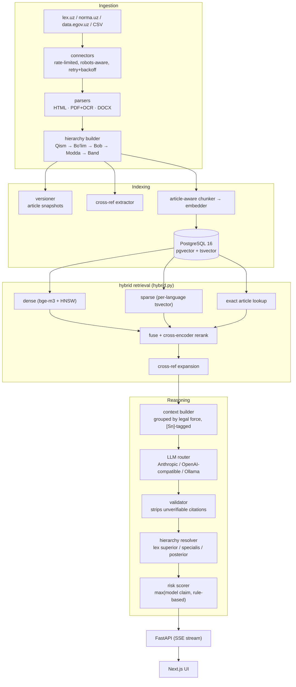

<div align="center">

# QonunAI

**An AI legal research platform for the Republic of Uzbekistan — a hybrid-RAG system that answers legal questions in Uzbek (Latin & Cyrillic), Russian, and English, grounded in real statutory text with verifiable article-level citations.**

Every legal claim resolves to a real `[Sn]` source tag. Citations to articles that were never retrieved get stripped before they reach the user, not just flagged — see [How the anti-hallucination guarantee actually works](#how-the-anti-hallucination-guarantee-actually-works).

**[→ Try the live app](https://ai-frontend-ten-roan.vercel.app)**  ·  [API](https://uzlex-ai.fly.dev/docs)  ·  [Health & corpus status](https://uzlex-ai.fly.dev/health)

[](https://github.com/AbdullohRR/QonunAI/actions/workflows/backend-tests.yml)
[](https://www.python.org/)
[](https://fastapi.tiangolo.com/)
[](https://github.com/pgvector/pgvector)
[](LICENSE)

</div>

---

**At a glance.** 13 codes indexed, 11,538 chunks, live on Fly.io + Vercel.
Retrieval scores **Recall@5 = 0.931, MRR = 0.852** on `uzlegal-v1`, a 58-question
gold set spanning every indexed act — see [Retrieval benchmark](#retrieval-benchmark),
which also records where an earlier, better-looking 1.000 came from and why it
was not kept. 503 tests run on every push.

What was measured, what was tried and rejected, and where the system still
fails is all written down — in [docs/](#documentation) where it does not crowd
this page. If you are skimming, these four carry the engineering:

| | |
|---|---|
| [Architecture](#how-it-works--architecture) | How a question becomes a cited answer |
| [Anti-hallucination](#how-the-anti-hallucination-guarantee-actually-works) | Why a fabricated citation cannot reach the user — and the bug that broke it |
| [Retrieval benchmark](#retrieval-benchmark) | The measurements, including the unflattering ones |
| [Deployment status](docs/RETRIEVAL.md#deployment-status) | Four defects that hid a silently-dead dense retrieval path |

---

## What is this?

Ask a legal question the way you'd actually ask it — in any of four languages, in
either Uzbek script — and get back an answer grounded only in the actual text of
the Constitution and Codes, never a guess from the model's own training data.

> "Жиноят кодексининг 97-моддасида қандай жазо белгиланган?"
> "Какие основания для расторжения трудового договора по инициативе работодателя?"
> "14 yoshli o'smir o'g'irlik qilsa, javobgarlikka tortiladimi?"

...or upload a contract and get a clause-by-clause compliance screen against
mandatory Uzbek law, with concrete risks and redrafting suggestions — not a
generic "looks fine to me."

## Demo

<div align="center">

</div>

*Real conversation against the actual running app — retrieval, LLM generation, and citation-tagged output, not a mockup.*

Two more below show behaviour rather than chrome:
[answering in the script you typed](docs/ANSWER-STYLE.md#reply-in-the-script-the-user-typed) and
[answering at the length you asked for](docs/ANSWER-STYLE.md#answer-at-the-length-that-was-asked-for).
Both are drawn from recorded sessions against `uzlex-ai.fly.dev` — the
questions, answers, sources, retrieval times and elapsed times in them are the
captured ones, rendered as a terminal rather than filmed from the browser.

## Key features

| | |
|---|---|
| **Citation-grounded Q&A** | Every legal statement carries an `[Sn]` tag resolving to a specific article. Uncited or unverifiable answers are rejected, not softened. |
| **Article-level deep links** | Citations open the *provision*, not the top of a 4 MB document — `lex.uz/docs/6257288#6259020` lands directly on 80-modda. See [Deep linking into lex.uz](docs/DEEP-LINKING.md). |
| **Hybrid retrieval** | Dense (`bge-m3` + pgvector HNSW) + sparse (per-language Postgres FTS) + article-title + exact-article lookup, fused by RRF. Cross-encoder reranking is implemented but off in the live deployment — see [Deployment status](docs/RETRIEVAL.md#deployment-status). |
| **Legal hierarchy reasoning** | Constitution > Codes > Laws > Decrees, then *lex specialis*, then *lex posterior* — computed deterministically from adoption dates and act type, not left to the model to reason about on the fly. |
| **Cross-reference expansion** | "…in the cases provided for by Article 333 of this Code" automatically pulls Article 333 into context. |
| **Document analysis** | Contracts segmented clause-by-clause, screened against mandatory Uzbek norms by both regex red-flags and an LLM compliance pass, with risk levels and concrete redrafting suggestions. |
| **Trilingual + dual-script** | Uzbek Latin↔Cyrillic transliteration on both queries and index. Ask in Russian, retrieve from a Cyrillic-only source, answer in Russian — cross-language retrieval, not just translation. |
| **Independent risk scoring** | The risk level shown is the *higher* of the model's own claim and a rule-based assessor (procedural deadlines, criminal exposure, conflicting provisions) — under-stating risk is the expensive failure mode here. |
| **Provider-agnostic LLM layer** | Anthropic, any OpenAI-compatible endpoint (Groq, Gemini, vLLM, Together), or local Ollama — swappable via one env var, no code changes. |
| **Answers shaped by how you asked** | Reply in the script you typed, at the length you asked for, and answer ordinary questions like a person instead of deflecting — see [Answering the way the question was asked](docs/ANSWER-STYLE.md). |
| **Four ways to sign in** | Email, Telegram, Google, and phone-by-SMS — each dormant until its provider is configured, never a button that cannot work. See [Accounts and sign-in](docs/ACCOUNTS-AND-BILLING.md). |
| **Plans and billing** | Free / signed-in / Pro tiers with per-day request limits, and a Payme merchant integration for Pro — see [Plans and billing](docs/ACCOUNTS-AND-BILLING.md#plans-and-billing). |

## Tech stack

- **Backend:** FastAPI, SQLAlchemy 2 (async), Alembic, Celery + Redis (ingestion, corpus stats, connector health checks)
- **Retrieval:** PostgreSQL 16 + pgvector (HNSW cosine), `BAAI/bge-m3` multilingual embeddings, Postgres full-text search, `BAAI/bge-reranker-v2-m3` cross-encoder
- **LLM layer:** a thin provider router — Anthropic, OpenAI-compatible (Groq / Gemini / vLLM / Together), or local Ollama, selectable globally or per-request
- **Frontend:** Next.js 16 (App Router), React 19, TypeScript (strict), Tailwind — token-streamed SSE chat with markdown rendering and deep-linked citation cards
- **Ingestion:** rate-limited, robots-aware connectors for lex.uz / norma.uz / data.egov.uz, with HTML/PDF+OCR/DOCX parsing and a hierarchy builder (Qism → Bo'lim → Bob → Modda → Band)

## How it works — architecture



Full diagrams and design rationale: [`docs/ARCHITECTURE.md`](docs/ARCHITECTURE.md).

## How the anti-hallucination guarantee actually works

The hard part of a legal AI isn't generating fluent text — it's refusing to
invent law. Prompt instructions alone don't achieve that, so the guarantee is
enforced mechanically, not just requested:

1. Retrieved passages are tagged `[S1]…[Sn]`; the valid tag set is recorded
   *before* the model sees the question.
2. The model is instructed to cite those tags inline and to say plainly when
   the sources don't cover the question.
3. **The validator then checks the output against that recorded tag set.**
   Tags outside it are stripped from the answer. Article numbers asserted in
   prose but absent from retrieval are flagged as unverified. A tag attributed
   in prose to the wrong act (real tag, real article, just the wrong law
   named next to it — the subtlest of the three failure modes, since both the
   tag and the article number check out individually) gets an inline
   correction appended right where the false claim was made, not just a
   warning at the end the reader has to cross-reference. A substantive answer
   with no citations at all is rejected outright and replaced with an honest
   "not found" message.
4. The risk scorer runs independently of the model's own risk claim (if it
   makes one — the prompt asks it not to, since the risk badge already
   renders this from the same structured assessment) and takes the
   **higher** of the two. If the model states a level anyway, it's
   reconciled to match rather than left to silently contradict the badge.
5. The streamed `done` event carries the *validated* text, and the client
   swaps it in — so a stripped citation never stays on screen, even for the
   tokens that streamed before validation ran.

The hole this guarantee had for most of the project's life — a legal question
answered with no sources at all, which none of the five steps above caught — is
documented in [Grounding](docs/GROUNDING.md).

## Retrieval benchmark

Quality claims are measured, not asserted. `uzlegal-v1`
([`backend/benchmarks/`](backend/benchmarks/)) holds **58 scored questions**
across **all 13 indexed acts** in Uzbek Latin, Uzbek Cyrillic and Russian, plus
out-of-scope and adversarial items. Gold article numbers were read directly from
`chunks.heading` in the production corpus and every `(act, article)` pair was
validated against it before being added. Questions deliberately *paraphrase* the
article's subject rather than restating its title, so the set does not simply
reward the article-title branch.

A hit requires **both** the article number and the act to match, so a
coincidental article 106 in the wrong code does not count.

```bash
python backend/benchmarks/run_benchmark.py --base https://uzlex-ai.fly.dev --answers 0
```

| Metric | Sparse only | With dense | + heading fixes | Current (57 q) | Target |
|---|---|---|---|---|---|
| Recall@1 | 0.600 | 0.733 | 0.767 | **0.793** | — |
| Recall@3 | — | 0.867 | 0.933 | **0.877** | — |
| Recall@5 | 0.833 | 0.867 | 0.933 | **0.931** | 0.90 ✅ |
| Recall@10 | — | 0.933 | 1.000 | **0.983** | 0.95 ✅ |
| MRR | 0.694 | 0.807 | 0.854 | **0.852** | 0.75 ✅ |
| Median retrieval | 695 ms | 1276 ms | 1327 ms | 1441 ms | < 2000 ms |

### Read this before trusting the earlier columns

The first four columns are **30 questions covering 4 acts**. On that set the
system reached Recall@5 = 1.000 and MRR = 0.928. Expanding to 57 questions over
all 13 acts dropped it to 0.860 and 0.791. The fusion constants had been swept
against the 30-question set, and the 1.000 was substantially an artefact of
that — which is what a benchmark that small will do to any parameter fitted to
it. The current column is the honest number, and the constants have *not* been
re-tuned against it, because doing so would just repeat the mistake at a larger
size.

Run-to-run variation is also real: two consecutive runs of this same
configuration scored MRR 0.705 and 0.791, the first against a colder embedding
cache. Single runs are indicative, not precise.

## Setup

### Requirements

- Docker + Docker Compose
- An LLM API key — Anthropic, or any OpenAI-compatible provider (Groq, Gemini,
  etc.). A local-only path via Ollama also works with no API key at all.

### Install & run

```bash
cp .env.example .env
# set SECRET_KEY and at least one LLM provider key
docker compose up -d --build
```

Load a corpus — this repo's bundled CSV path is instant and deterministic:

```bash
docker compose exec backend python -m scripts.bootstrap \
  --admin admin@yourfirm.uz \
  --seed-csv-dir /app/data/seed
```

Open **http://localhost:3000**. API docs at **http://localhost:8000/docs**.

Full instructions, including crawling lex.uz directly: [`docs/DEPLOYMENT.md`](docs/DEPLOYMENT.md).

> **Iterating on the code?** `docker-compose.yml` bind-mounts `backend/app`
> into the backend, worker, and beat containers — a plain `docker compose
> restart backend` picks up code changes. `.env` changes need a recreate:
> `docker compose up -d backend`.

## API surface

| Endpoint | Purpose |
|---|---|
| `POST /api/v1/chat/stream` | SSE legal Q&A — `meta` → `sources` → `delta`* → `done` |
| `POST /api/v1/chat` | Non-streaming equivalent |
| `POST /api/v1/search` | Raw hybrid retrieval, no LLM — inspect what RAG actually finds |
| `POST /api/v1/search/article` | "Ask by article" — fetch and explain a named article |
| `POST /api/v1/documents/analyze` | Upload and analyse a contract |
| `GET /api/v1/laws` · `/{id}/tree` | Browse acts and their structural trees |
| `GET /api/v1/laws/{id}/articles/{n}/timeline` | Version history and diffs |
| `GET /api/v1/alerts` | New / amended acts |
| `POST /api/v1/auth/register` · `/login` · `/refresh` · `/me` | Email accounts and session tokens |
| `POST /api/v1/auth/telegram` · `/google` | Social sign-in — verify a signed payload, issue our own tokens |
| `POST /api/v1/auth/phone/request` · `/phone/verify` | SMS code request and exchange |
| `POST /api/v1/payments/payme` | Payme merchant JSON-RPC endpoint (`CheckPerformTransaction`, `CreateTransaction`, `PerformTransaction`, `CancelTransaction`, `CheckTransaction`, `GetStatement`) |
| `POST /api/v1/admin/ingest` | Trigger ingestion (admin) |
| `GET /api/v1/admin/connectors/health` | Connector reachability + selector validation |
| `GET /health` | Liveness, corpus size, provider status |

## Tests

```bash
cd backend && pytest tests/ -v
```

503 unit tests, no database or network required — verified passing. They cover
the places where a silent regression is most damaging: transliteration (halves
Uzbek recall if wrong), hierarchy parsing (wrong citations), citation
validation (hallucinations reaching users), the hierarchy-of-force rules
(wrong legal conclusions), anchor extraction (citations that open the wrong
article), the scope gate (legal questions answered without sources), token
verification for all three sign-in providers, and the Payme state machine.

Some of them assert things that read oddly until you know what they caught:

```python
assert "compare_digest" in inspect.getsource(payme.check_auth)
assert claims.get("email_verified") is True   # not `in (True, "true")`
```

The first pins a constant-time comparison on a public endpoint against a
future refactor that would "simplify" it to `==`. The second exists because
Python holds `1 == True`, so a membership test silently accepts the integer
`1` as a verified Google address — found by a test that fed it exactly that.

> **Never pipe the command that gates a deploy.** `pytest -q | tail -2 && git
> commit && fly deploy` returns *tail's* exit code, so the gate is always
> green. That is how a syntax error reached production here and took the API
> down with a crash loop.

## Production deployment

The live instance runs split across two providers:

| Component | Host | Notes |
|---|---|---|
| Frontend | Vercel | Next.js 16, streams SSE from the API |
| API | Fly.io (`fra`) | FastAPI, `shared-cpu-4x` / 2 GB |
| Postgres + pgvector | Fly.io | 3 GB volume, private networking only |
| Redis | Fly.io | Rate limits and cache, private networking only |

Neither datastore is publicly reachable — the API talks to them over Fly's
private network, and the schema is migrated through a temporary
`flyctl proxy` tunnel rather than an exposed port.

```bash
cd backend && flyctl deploy --now
```

**Measured end-to-end on the live instance** (Labour Code question,
uz-Latn): retrieval **346 ms**, LLM generation **11,090 ms**, total
**12.7 s**. Generation is 87% of wall-clock — retrieval is not the
bottleneck, so optimisation effort belongs in prompt caching, context size,
and time-to-first-token rather than in the retriever.

> Machines are configured to scale to zero (`min_machines_running = 0`), so
> the first request after an idle period pays a cold start that includes
> loading the embedding model. Set it to `1` before a demo.

## What's been verified against the real running app

Beyond the unit suite, the full stack was exercised end-to-end against the
live app — not just mocked — across ten scenarios chosen to stress specific
failure modes: exact-article pinning in Cyrillic, cross-language retrieval
(a Russian question answered from a Cyrillic-only source), honest refusal
versus fabrication when a requested topic isn't in the corpus, a deliberately
fabricated article number, hierarchy-of-force conflict resolution, cross-
reference expansion, risk escalation on procedural deadlines, multi-code
synthesis, and criminal liability involving a minor — plus a full contract
upload through the actual browser UI, with the automated red-flag screen and
the LLM compliance pass both verified against the rendered output.

## Known limitations

Being direct about these rather than glossing over them:

- **Corpus coverage is partial.** The bundled seed loads the Constitution,
  both parts of the Civil Code, Civil Procedure, Criminal, Criminal
  Procedure, Administrative Liability, Labour, Tax, Family, and Budget Codes
  — 13 acts, 11,500+ chunks across Uzbek Latin, Uzbek Cyrillic, and Russian.
  Land, Customs, Housing, and Urban Planning legislation are not loaded; a
  question on those topics correctly says the retrieved sources don't cover
  it rather than guessing, but there's no real answer behind that honesty
  yet — load more acts via the ingestion connectors to close the gap.
- **Answer latency is dominated by the LLM, not retrieval.** On the live
  Fly.io instance retrieval takes **346 ms** while generation takes **11.1 s**
  — 87% of the 12.7 s round trip. Local CPU-only runs can be far slower still
  (1–3 minutes against the full unfiltered corpus). `EMBEDDING_DEVICE=cuda` fixes
  this if a GPU is available — verified on an RTX 4050 (6 GB): retrieval
  dropped from 56–100s to **~11s**, roughly a 5–9x speedup, with the
  embedder and reranker actually saturating the GPU at ~100% utilization
  during a query. See the GPU section in
  [`.env.example`](.env.example) for what else that needs (a CUDA torch
  build via `TORCH_INDEX_URL`, the backend's GPU device reservation in
  `docker-compose.yml`, and `UVICORN_WORKERS=1` so two worker processes
  don't each load their own copy of both models onto the same card).
- **Free-tier LLM providers have real, sometimes surprising limits.** Groq's
  free "on_demand" tier shares one daily token quota per *organization*, not
  per key — issuing a new key under the same account doesn't get you a fresh
  quota. Gemini's model aliases (e.g. `gemini-flash-latest`) can silently
  resolve to a brand-new model with a much stricter free-tier cap than an
  established one. Worth knowing before assuming a "new key" fixes a
  rate-limit wall.
- **A generic legal keyword can be a footgun for act-type inference.**
  Retrieval infers an act-type filter from words like a named Code
  ("Civil Code", "Fuqarolik kodeksi") to narrow the search. Earlier in
  development this list also included the bare word "law"/"qonun"/"закон" —
  which is such a common word in ordinary legal phrasing that it produced
  false-positive filtering to a specific act category, silently returning
  zero results on any query that happened to contain it. That specific hint
  has been removed; the remaining ones are all precise multi-word or
  Code-specific patterns, deliberately chosen not to fire on ordinary usage.
- **Sub-numbered articles are collapsed at ingestion.** `chunks.article_number`
  stores no separators, so articles 57, 57¹ and 57² all land as `"57"` —
  legally distinct provisions sharing one identifier, distinguishable only by
  heading. Deep linking works around this by disambiguating on the heading, but
  the underlying citation ambiguity is real and predates that work. Fixing the
  parser would raise anchor coverage above 84.2% and remove the ambiguity at
  source.
- **Full-corpus crawling is bounded by politeness, not engineering.**
  `lex.uz/robots.txt` publishes `Crawl-delay: 20`, capping one compliant
  crawler at ~4,320 documents/day. Codes and laws are a day or two; everything
  including historical revisions is measured in months. Parallelising to beat
  this would violate robots.txt — the legitimate route to national-scale
  coverage is a bulk-data agreement with the Ministry of Justice, not a faster
  scraper.
- **Retrieval quality is measured, and two questions still miss.** `uzlegal-v1`
  (`backend/benchmarks/`) now scores **Recall@5 = 0.931** and **Recall@10 =
  0.983** against targets of 0.90 and 0.95, on 58 questions across all 13
  acts — up from 0.433 at first measurement. `uz-104` and `uz-160` remain
  outside the top five, and are left failing on purpose: both are reachable
  only by mapping one inflected verb form to one statutory phrase, which is
  where useful generalisation stops and benchmark-fitting begins. A working
  cross-encoder reranker is the honest fix, and that is blocked on latency
  (above).
- **Not production-hardened.** Secrets live in a plaintext `.env` (correctly
  gitignored, but not vaulted), there's no rate-limit-aware secrets rotation,
  and this hasn't been through a security review. See the ingestion caveats
  below before pointing this at a production dataset.

## Documentation

The README covers what the system does and how to run it. These carry the detail,
including the measurements that did not flatter the system:

| | |
|---|---|
| [Retrieval](docs/RETRIEVAL.md) | Deployment status, what dense retrieval bought, why reranking is off, and the full benchmark record — vocabulary gaps, cross-language retrieval, the transliteration defects, and what was tried and rejected |
| [Grounding](docs/GROUNDING.md) | How the citation guarantee broke, how it was found, and what closes it |
| [Architecture](docs/ARCHITECTURE.md) | Component-level design |
| [Ingestion](docs/INGESTION.md) | Connectors, parsing, and the hierarchy builder |
| [Deployment](docs/DEPLOYMENT.md) | Fly.io + Vercel deployment, and the pre-production checklist |
| [Answer style](docs/ANSWER-STYLE.md) | Script mirroring, answer length, and ordinary questions |
| [Deep linking](docs/DEEP-LINKING.md) | Resolving citations to a specific lex.uz provision |
| [Accounts & billing](docs/ACCOUNTS-AND-BILLING.md) | Sign-in methods and the Payme integration |

## License

[MIT](LICENSE) for this codebase. The legal texts themselves are official
publications of the Republic of Uzbekistan and carry their own terms; this
repository does not redistribute them beyond what's needed to run the demo
corpus.
